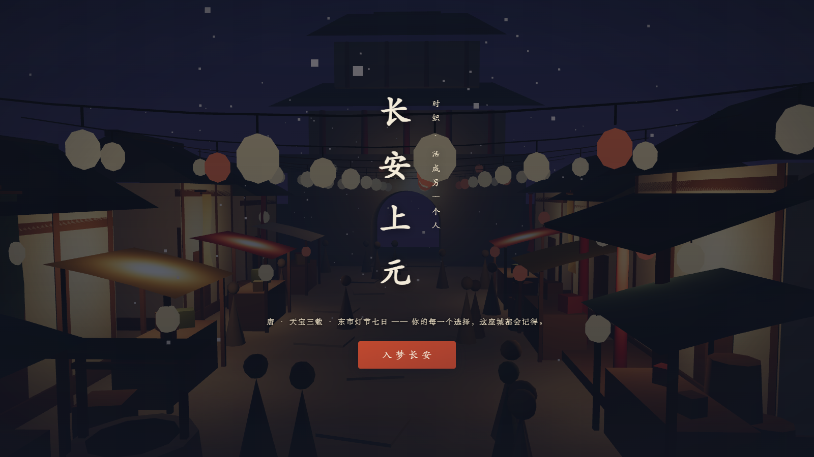

# 时织 ChronoLoom — 长安上元

An AI-native alternate-life simulator. First playable slice: **Tang Chang'an, East Market, the seven days of the Lantern Festival (上元灯节)**. You enter as one of four concrete identities, make meaningful choices in a living 3D market diorama, and an AI Director simulates the consequences — relationships shift, rumors spread, the timeline remembers. At the end you receive a 命书 (life report) grounded in what you actually did.



## Quick start

Requires Node 20+.

```sh
npm install
copy .env.example .env     # then put your Anthropic API key in .env (optional)
npm run dev                # client http://localhost:5173 · api http://localhost:8787
```

- **With `ANTHROPIC_API_KEY` set in `.env`** → the live Claude engine (`claude-opus-4-8`) drives the simulation: every turn is generated from structured world state via strict JSON schemas.
- **Without a key** → the deterministic offline engine drives the same game (authored festival-week spine + outcome tables). Fully playable, zero API cost.
- If a live turn fails mid-game, the scripted engine silently serves that turn (`CHRONOLOOM_FALLBACK=true`) — the player never stalls.

`.env` values take precedence over inherited shell variables.

## Scripts

| Command | What it does |
|---|---|
| `npm run dev` | Dev mode: API server (:8787) + Vite client (:5173), one command |
| `npm run typecheck` | Strict TS across shared/server/client/tests |
| `npm run test` | Unit tests (reducer, clamps, determinism, store) |
| `npm run e2e` | Full offline playthrough — two lives, divergence asserted, ~134 checks |
| `npm run test:live` | One real Claude life-start + turn (SKIPs without a key) |
| `npm run build` | Typecheck + production client build to `dist/client` |
| `npm start` | Production: serve API + built client on :8787 |

## How it works

```
player choice ──▶ Director (Claude structured-output call, or scripted tables)
                      │ returns DirectorTurn: scene + choices + bounded state deltas
                      ▼
              clamp.ts  (anti-drift: numeric caps, known ids, access gates)
                      ▼
            applyTurn.ts (pure reducer: state, tendencies, timeline, causal ledger)
                      ▼
          atomic JSON persistence ──▶ redacted SessionView ──▶ React UI + Three.js diorama
```

- **One world, five NPCs, one knot:** the market审计 (audit), a missing ledger page, a musician's indenture, a poetry night — every identity enters the same spine from a different side.
- **The model proposes, the validator disposes:** trust moves ±15/turn max, money ±2000文, unknown NPCs/locations rejected, every correction logged to the session's `validationLog`.
- **The report can't hallucinate:** turning points must cite real timeline event ids; value chips must match the server-computed tendency histogram. Ungrounded claims are deleted.
- **Visuals are state:** the backend returns a `SceneDirective` (location/time/weather/mood/crowd/lanterns); the procedural Three.js diorama re-lights, re-crowds and re-frames itself — location changes are camera + lighting changes on one set.

Dev scene harness: open `http://localhost:5173/#/dev/scene` for every directive knob + FPS/draw-call readout + screenshots.

## Project layout

- `shared/` — Zod schemas + enums: the single source of truth for state, engine output and API DTOs
- `server/` — Hono API, engines (`claudeDirector` / `scriptedDirector`), simulation (`clamp`/`applyTurn`/`pacing`), JSON store, all Chinese game content (`content/`)
- `client/` — React screens + components; `client/src/scene/` is the framework-free Three.js diorama
- `scripts/` — `e2e-playthrough.ts`, `live-turn.ts`
- `data/sessions/` — saved lives (gitignored)

See `PROJECT.md` for the product vision and `ROADMAP.md` for the build log.
